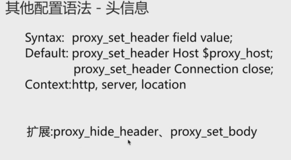
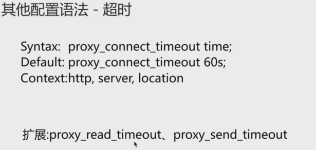
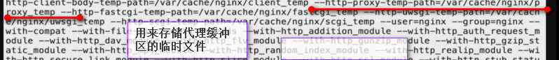
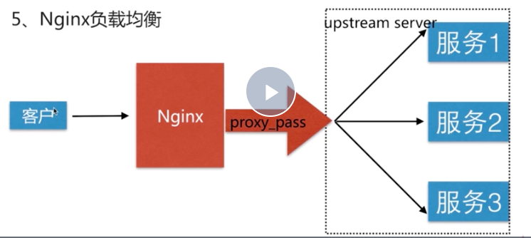

# nginx 场景实践

## 静态资源web服务


nginx作为静态资源的http server其可以接收客户端类似于jpeg、html、flv 等静态资源的请求，然后直接通过静态文件的存储得到这些文件返回给客户端，这中方式是一种典型的比较高效的方式；这种场景经常会利用在 我们对静态资源的处理、请求、动静分离场景下面的应用

我们可以在请求一个网站的时候简单分为两类，一种是静态请求，一种是动态请求；而对于我们服务端，接收静态请求与动态请求时不一样的； 动态请求 我们时需要服务端的解释器进行一些比较复杂的逻辑运算，将对应的数据进行必要的封装，然后反馈给用户，这种数据时动态生成的； 对于那些不需要服务端动态生成的，即所请求的东西，在服务器上的文件目录中就可以直接找到的东西，则这种请求就是静态资源请求，文件就是静态资源文件


```bash
server {
    listen       80;
    server_name  116.62.103.228 jeson.imooc.com;
    
    sendfile on;
    #charset koi8-r;
    access_log  /var/log/nginx/log/static_access.log  main;

    
    location ~ .*\.(jpg|gif|png)$ {
        gzip on;
        gzip_http_version 1.1;
        gzip_comp_level 2;
        gzip_types text/plain application/javascript application/x-javascript text/css application/xml text/javascript application/x-httpd-php image/jpeg image/gif image/png;
        root  /opt/app/code/images;
    }

    location ~ .*\.(txt|xml)$ {
        gzip on;
        gzip_http_version 1.1;
        gzip_comp_level 1;
        gzip_types text/plain application/javascript application/x-javascript text/css application/xml text/javascript application/x-httpd-php image/jpeg image/gif image/png;
        root  /opt/app/code/doc;
    }

    location ~ ^/download {
        gzip_static on;
        tcp_nopush on;
        root /opt/app/code;
    }

    #error_page  404              /404.html;

    # redirect server error pages to the static page /50x.html
    #
    error_page   500 502 503 504 404  /50x.html;
    location = /50x.html {
        root   /usr/share/nginx/html;
    }

    # proxy the PHP scripts to Apache listening on 127.0.0.1:80
    #
    #location ~ \.php$ {
    #    proxy_pass   http://127.0.0.1;
    #}

    # pass the PHP scripts to FastCGI server listening on 127.0.0.1:9000
    #
    #location ~ \.php$ {
    #    root           html;
    #    fastcgi_pass   127.0.0.1:9000;
    #    fastcgi_index  index.php;
    #    fastcgi_param  SCRIPT_FILENAME  /scripts$fastcgi_script_name;
    #    include        fastcgi_params;
    #}

    # deny access to .htaccess files, if Apache's document root
    # concurs with nginx's one
    #
    #location ~ /\.ht {
    #    deny  all;
    #}
}

```

### 静态资源服务场景CDN

> CDN有称为内容分发网络

## 代理服务

```bash
# fx_proxy.conf中

server {
    listen       80;
    server_name  localhost jeson.t.imooc.io;

    #charset koi8-r;
    access_log  /var/log/nginx/test_proxy.access.log  main;

    location / {
        root   /usr/share/nginx/html;
        index  index.html index.htm;
    }
    
    location ~ /test_proxy.html$ {
        proxy_pass http://127.0.0.1:8080;
    }

    #error_page  404              /404.html;

    # redirect server error pages to the static page /50x.html
    #
    error_page   500 502 503 504  /50x.html;
    location = /50x.html {
        root   /usr/share/nginx/html;
    }

    # proxy the PHP scripts to Apache listening on 127.0.0.1:80
    #
    #location ~ \.php$ {
    #    proxy_pass   http://127.0.0.1;
    #}

    # pass the PHP scripts to FastCGI server listening on 127.0.0.1:9000
    #
    #location ~ \.php$ {
    #    root           html;
    #    fastcgi_pass   127.0.0.1:9000;
    #    fastcgi_index  index.php;
    #    fastcgi_param  SCRIPT_FILENAME  /scripts$fastcgi_script_name;
    #    include        fastcgi_params;
    #}

    # deny access to .htaccess files, if Apache's document root
    # concurs with nginx's one
    #
    #location ~ /\.ht {
    #    deny  all;
    #}
}

```

```bash

# realserver.conf中
server {
    listen       8080;
    server_name  localhost jeson.t.imooc.io;

    #charset koi8-r;
    access_log  /var/log/nginx/server.access.log  main;

    location / {
        root   /opt/app/code2;
        index  index.html index.htm;
    }

    #error_page  404              /404.html;

    # redirect server error pages to the static page /50x.html
    #
    error_page   500 502 503 504  /50x.html;
    location = /50x.html {
        root   /usr/share/nginx/html;
    }

    # proxy the PHP scripts to Apache listening on 127.0.0.1:80
    #
    #location ~ \.php$ {
    #    proxy_pass   http://127.0.0.1;
    #}

    # pass the PHP scripts to FastCGI server listening on 127.0.0.1:9000
    #
    #location ~ \.php$ {
    #    root           html;
    #    fastcgi_pass   127.0.0.1:9000;
    #    fastcgi_index  index.php;
    #    fastcgi_param  SCRIPT_FILENAME  /scripts$fastcgi_script_name;
    #    include        fastcgi_params;
    #}

    # deny access to .htaccess files, if Apache's document root
    # concurs with nginx's one
    #
    #location ~ /\.ht {
    #    deny  all;
    #}
}


```

###  其它配置语法

> 头信息
 
 

 有时候我们需要将nginx作为代理服务器，但后端的server时需要读取一些头信息，而这些头信息时不准确的； 也就是在nginx做为访问控制这一层里面。remote_dir(没听清)这个信息就在后端的服务器里面，因为走了代理，所以后端就没办法读取对应的消息，此时就需要用到proxy_set_header 也就是发给后端的服务器里面 我们增加一个对应的头 将对应的信息 用新的这个头的方式 携带到后端 让后端能够读取到；这个时头信息的一个配置

 proxy_hide_header : 隐藏一些头不够后端访问到


> 超时：nginx作为代理到后端服务器中间的一个超时，这个超时 是一个tcp链接超时,当建立完链接之后，就有另外两个超时proxy_read_timeout、proxy_send_timeout



proxy_read_timeout : 已经建立好的链接的情况下面，在nginx作为代理和后端server之间让它会等待多长时间

proxy_send_timeout： 服务端请求完毕 发送给客户端的时间


### 补充配置

```bash
# fx_proxy.conf中
server {
    listen       80;
    server_name  localhost jeson.t.imooc.io;

    #charset koi8-r;
    access_log  /var/log/nginx/test_proxy.access.log  main;

    
    location / {
        #1 必须要使用到的跳转配置
        proxy_pass http://127.0.0.1:8080;
        include proxy_params;
    }

    #error_page  404               /404.html;

    # redirect server error pages to the static page /50x.html
    #
    error_page   500 502 503 504  /50x.html;
    location = /50x.html {
        root   /usr/share/nginx/html;
    }

    # proxy the PHP scripts to Apache listening on 127.0.0.1:80
    #
    #location ~ \.php$ {
    #    proxy_pass   http://127.0.0.1;
    #}

    # pass the PHP scripts to FastCGI server listening on 127.0.0.1:9000
    #
    #location ~ \.php$ {
    #    root           html;
    #    fastcgi_pass   127.0.0.1:9000;
    #    fastcgi_index  index.php;
    #    fastcgi_param  SCRIPT_FILENAME  /scripts$fastcgi_script_name;
    #    include        fastcgi_params;
    #}

    # deny access to .htaccess files, if Apache's document root
    # concurs with nginx's one
    #
    #location ~ /\.ht {
    #    deny  all;
    #}
}

```

```bash
# proxy_params中

# 2.除非时后端返回301 且我们要进行一些改写 否则都将其配置为默认
proxy_redirect default;

# 3. 将nginx的代理向向后端的server发送信息的时候，所添加的头信息
proxy_set_header Host $http_host;
# 3.1 后端的server通过代理之后其实没法获取真实的用户ip的，往往要做用户访问限制，或实际上有常常需要获取用户的ip信息 ，这样我们就需要在前端将真实的用户ip信息 带到后端去 
proxy_set_header X-Real-IP $remote_addr;

# 4 链接超时的配置
proxy_connect_timeout 30;
proxy_send_timeout 60;
proxy_read_timeout 60;

# 5 缓冲区的一系列设置
proxy_buffer_size 32k;
proxy_buffering on;
proxy_buffers 4 128k;
proxy_busy_buffers_size 256k;
proxy_max_temp_file_size 256k;

```



```bash
# realserver.conf中
server {
    listen       8080;
    server_name  localhost jeson.t.imooc.io;

    #charset koi8-r;
    access_log  /var/log/nginx/server.access.log  main;

    location / {
        root   /opt/app/code2;
        index  index.html index.htm;
    }

    #error_page  404              /404.html;

    # redirect server error pages to the static page /50x.html
    #
    error_page   500 502 503 504  /50x.html;
    location = /50x.html {
        root   /usr/share/nginx/html;
    }

    # proxy the PHP scripts to Apache listening on 127.0.0.1:80
    #
    #location ~ \.php$ {
    #    proxy_pass   http://127.0.0.1;
    #}

    # pass the PHP scripts to FastCGI server listening on 127.0.0.1:9000
    #
    #location ~ \.php$ {
    #    root           html;
    #    fastcgi_pass   127.0.0.1:9000;
    #    fastcgi_index  index.php;
    #    fastcgi_param  SCRIPT_FILENAME  /scripts$fastcgi_script_name;
    #    include        fastcgi_params;
    #}

    # deny access to .htaccess files, if Apache's document root
    # concurs with nginx's one
    #
    #location ~ /\.ht {
    #    deny  all;
    #}
}

```

## 负载均衡调度器SLB

### nginx 负载均衡


> 为什么需要负载均衡服务，

### SLB 模式


一般调度节点与服务节点同处在一个逻辑单元里面，当海量信息请求过来之后 其请求的是调度节点，调度节点将服务请求转发给后端对应的服务节点； 服务节点将响应发送至调度节点，调度节点再去响应给客户；

 

### 七层负载均衡与四层负载均衡
利用网络的模型 也就是osi的模型，可以分为两种概念，一种是四层负载均衡、一种是七层负载均衡；

所谓四层负载均衡就是`osi`模型中的`传输层` 传输层已经能支持tcp 协议的控制，所以器只需要对客户端的请求进行tcp\ip协议的包转发，就可以实现这个负载均衡，其好处是性能快，只需要对顶层进行应用处理，而不需要去进行一些比较复杂的逻辑，只需要进行包的转发就可以了；

与之对应的七层负载均衡就是osi模型中的应用层，所以其可以完成应用层面的协议的请求，如对于http ,其可以实现http信息的改写、头信息的改写、安全应用规则的控制 以及转发的规则，所以在应用层的服务里面，我们能做的更多；而nginx就是一个典型的七层负载均衡的slb

### nginx负载均衡的实现的原理



1. 其实nginx实现负载均衡的时候主要使用的就是proxy_pass，proxy_pass是代理模块的核心配置，其将所有的客户端请求代理，然后转发到后端的服务器上面
2. 但其实其并不是将请求转发到一台而是一组--一组服务池，我们称为upstream server; upstream server组中可以去定义所有服务的单元，如定义 服务1、服务2、服务3三个单元，它们三个单元都可以提供相同的类似的服务； 将它们三个放到同一个upstream组里面，在组里面其实现了对请求的分发； 这样当海量的用户请求过来的时候，upstream 这个模块就能不断的，将请求分发到不同的模块上面，从而实现负载均衡；
3. 所以proxy_pass 与 upsream server是实现负载均衡的两个核心的配置语法；

### upstream server的配置语法

```bash
Syntax: upstream name {...}
Default: ----
# upsream 必须得配置在http的下一层，也就是必须在server外面；
Context: http

```

### 实现负载均衡的实例

1. 我们准备了两台服务器，一台服务器单独做后端服务 提供真实的web服务，另外一台单独做负载均衡；


```bash
# 在opt/app/下面新建三个目录code1、code2、code3;在三个目录中分别存放了 三个不同的展示效果页面index.html

# 在 /etc/nginx/conf.d/新建三个server对应的：server1.conf server2.conf server3.conf  分别用来监听不同的端口  以表示建立起了单个端口不同的服务；server1--8001端口 server2---8002端口 server3---8003端口；对应的程序目录分别在code1 code2 code3上面

# 在浏览器或curl中使用公网ip加端口的方式进行访问，如自己的http://47.95.114.174:8001; 此时会发现页面是访问不到的，但利用netstat -luntp可以看到nginx在正常的监听； 归其原因是因为我们的aliyun配置了 防火墙的规则；以至于 我们的服务器无法收到客户端发送过来的请求 ；解决方式是修改阿里云安全组的规则 或iptables的规则；

# server1.conf
server {
    listen       8001;
    server_name  localhost;

    access_log  /var/log/nginx/log/server1.access.log  main;

    location / {
        root   /opt/app/code1;
        index  index.html index.htm;
    }

    error_page   500 502 503 504 404  /50x.html;
    location = /50x.html {
        root   /usr/share/nginx/html;
    }
}

# server2.conf
server {
    listen       8002;
    server_name  localhost;

    #charset koi8-r;
    access_log  /var/log/nginx/log/server2.access.log  main;

    location / {
        root   /opt/app/code2;
        index  index.html index.htm;
    }

    error_page   500 502 503 504 404  /50x.html;
    location = /50x.html {
        root   /usr/share/nginx/html;
    }

}

# server3.conf
server {
    listen       8003;
    server_name  localhost;

    location / {
        root   /opt/app/code3;
        index  index.html index.htm;
    }

    error_page   500 502 503 504 404  /50x.html;
    location = /50x.html {
        root   /usr/share/nginx/html;
    }

}


```

2. 我们会有三个服务对应不同的三个端口，接下来我们就要用负载均衡来配置不同的负载均衡的效果，我们用一个地址来代理负载到不同的服务器上面，我们就需要配置我们的前端的负载均衡服务器了；

```bash
# /etc/nginx/conf.d/upstream_test.conf 中

    # imooc是我们的名字是自定义的
    upstream imooc {
        # 三个服务节点分别是8001、8002、8003节点
        server 116.62.103.228:8001;
        server 116.62.103.228:8002;
        server 116.62.103.228:8003;
    }

server {
    listen       80;
    server_name  localhost jeson.t.imooc.io;

    access_log  /var/log/nginx/test_proxy.access.log  main;

    resolver  8.8.8.8;
    
    location / {
        # 在location这一级 将所有的请求都 proxy_pass到imooc也就是我们自定义的upstream组的name
        proxy_pass http://imooc;
        include proxy_params;
    }

   
    error_page   500 502 503 504  /50x.html;
    location = /50x.html {
        root   /usr/share/nginx/html;
    }
}


```


## 动态缓存


```bash
# 利用nginx 查看本机因为nginx而启用的端口

netstat -luntp|grep nginx

```

沟通就会有一些好的事情发生；