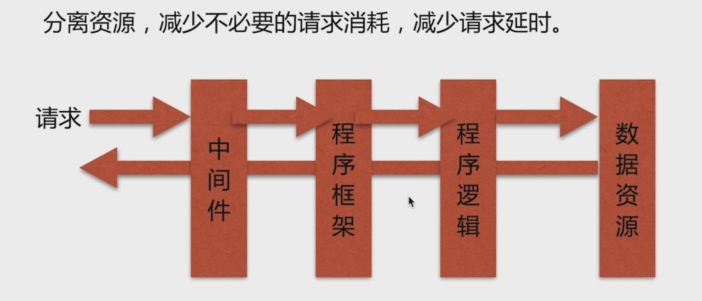
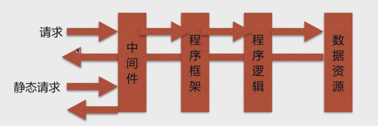
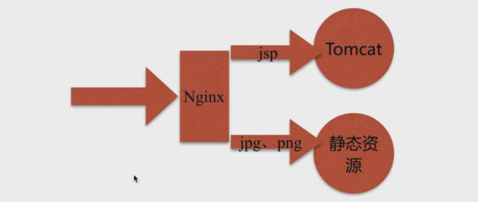

 # nginx 深入学习

 ## 动静分离 

 通过中间件将动态请求与静态请求分离。 目的对于服务端而言，分离资源可以减少不必要的请求消耗，较少请求延时；



 在没有做动态分离之前，一个请求首先回去请求中间件，然后由中间件将请求转发给中间框架，程序框架回去执行请求对应的一套运算逻辑，并通过调用数据库等去获取数据资源，然后返回；每一个请求都要经过这层层关系，现任会对后台的消耗，以及前台的响应时间都会差生影响；



  那么对于静态请求，其实并不需要经过程序框架，我们通过中间件，直接从硬盘中拖取到这个资源，直接返回给用户就可以了； 

  只有那种不需要缓存的动态请求，交互程度比较高的，才需要去走这四层关系；

  ### nginx作动静分离中间件的场景
  
  

tomcat主要负责jsp的所有的动态的请求，另外jpg、png等静态资源 我们利用nginx中间件 将其直接处理掉； 这样就通过nginx 将静态请求与动态请求分离开；


> linux 安装tomcat https://www.cnblogs.com/wangcMove/p/7606051.html
> linux 安装jdk https://www.cnblogs.com/Dylansuns/p/6974272.html

```bash
# linux 查看系统版本信息
lsb_release -a

```

